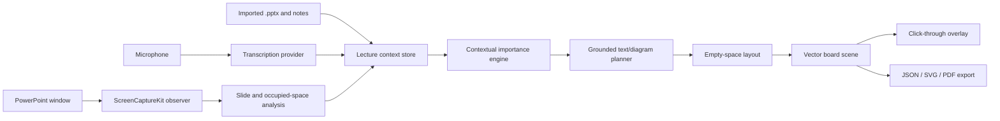

# Architecture

## Decision summary

LectureBoard AI uses a native macOS shell, a pure-Swift core package, a provider boundary around transcription and AI reasoning, and a vector scene graph for board output.

## Runtime separation

### Native application layer

SwiftUI and AppKit provide the setup window, presenter controls, transparent overlay, permissions, menu commands, and lifecycle.

### Capture and observation layer

ScreenCaptureKit discovers and captures only the selected PowerPoint window. The native adapter produces immutable preview frames, a coarse luminance fingerprint, and, when rasterization succeeds, a fixed 160-by-90 RGB content fingerprint. `LectureBoardCore` confirms coarse stability only after consecutive matching fingerprints. A confirmed large image difference is named `.significantVisualChange`; it is not a statement that the PowerPoint slide identity changed. The app counts both coarse stable visual changes and persistent dense-RGB changes as content revisions. `slideChangeCount` is reserved for an independent slide-identity signal that has not yet been implemented, so image-only changes do not increment it.

For each accepted stable visual frame or content update, the native analyzer creates an sRGB RGB8 raster whose long edge is at most 640 pixels. It runs Vision text recognition and rectangle detection and separately runs deterministic raster occupancy analysis. The raster output is deliberately named `strokeCandidateRegions`; candidates may include text, diagram edges, PowerPoint controls, or other window content and are not confirmed PowerPoint ink. Vision's lower-left coordinates are converted to the app's top-left normalized coordinate system before deterministic Core logic filters low-confidence, tiny, and near-full-frame detections, pads text, rectangles, and stroke candidates, and transitively merges touching occupied regions. The current analyzer receives the whole selected window rather than a cropped slide canvas. The app observes PowerPoint rather than modifying the source presentation in the first implementation.

The metadata-only runtime report uses schema version 3. It includes `contentRevisionCount` and `strokeCandidateRegionCount` while excluding captured images, recognized text, window titles, and coordinates. Schema-1 and pre-semantic-correction schema-2 reports remain decodable historical evidence, but their legacy `slideChangeCount` values represent the older image-difference heuristic rather than verified slide identity.

### LectureBoardCore

The independent Swift package owns serializable models, stable-frame and significant-visual-change classification, persistent RGB-content-change detection, RGB raster models, stroke-candidate analysis, slide-observation filtering, normalized occupied-region assembly, runtime-report models, importance scoring, grounded intent classification, empty-space layout, and scene composition. It does not import AppKit, ScreenCaptureKit, Vision, Speech, or any cloud SDK.

### Provider layer

Transcription and semantic-planning providers conform to narrow protocols. The initial repository includes an Apple Speech single-language prototype. Future providers may use SpeechAnalyzer, whisper.cpp, a local language model, or an explicitly configured cloud API.

## Intended core data flow

The following is the target end-to-end lecture flow, not a statement that every stage is implemented or runtime-verified. The current Core contains heuristic importance scoring, grounded intent classification, empty-space layout, vector scene composition, and evidence-bearing models. A dedicated factual validator, complete live context-store wiring, and stable live renderer animation remain unimplemented or unverified.

1. Final transcript segments enter the context store.
2. The importance scorer compares each segment with slide text and recent speech.
3. The classifier selects a board form without inventing new content.
4. A validator attaches source evidence and rejects unsupported names, numbers, dates, quotations, and formulas.
5. The layout engine chooses a free normalized region.
6. The scene composer emits vector elements.
7. The renderer animates only newly confirmed elements and leaves existing elements still.

## Scene graph

Board output is stored as text blocks, rounded rectangles, ellipses, lines, arrows, normalized positions, style roles, source intent identifiers, and language tags. This allows resolution-independent display and later SVG/PDF export.

## Failure-containment design

These are design constraints and prototype boundaries rather than a claim of complete runtime validation:

- The overlay prototype is a separate window intended to be click-through and immediately hideable; its runtime position, sizing, click-through behavior, and pen-tablet non-interference are unverified.
- PowerPoint remains the authoritative lecture application.
- The speech prototype does not modify or control PowerPoint; end-to-end runtime behavior during transcription failure is unverified.
- The deterministic classifier supports a deferred outcome for uncertain semantic input; end-to-end display gating is not yet implemented or verified.
- Session persistence is not implemented. When added, it is intended to be optional and transactional.

## Initial implementation compromises

- The first speech path handles one selected language at a time.
- The initial context engine is deterministic and heuristic, serving as a testable baseline.
- The first overlay uses the selected display rather than exact PowerPoint-window coordinate mapping.
- The current semantic build passes 80 Core tests and 71 native app tests, but it has not yet completed a live dynamic or mouse-ink run. A current-build dynamic attempt stopped before input because PowerPoint exposed no usable Accessibility window for the exact synthetic presentation. A proposed semantic-command fallback was not used after safety review. Historical schema-1 and pre-semantic schema-2 runs are build-specific evidence only.
- Image content is not an independent slide-identity signal. The current implementation intentionally leaves `slideChangeCount` at zero until such a signal is added.
- The current capture and analysis path uses the whole selected PowerPoint window. Slide-canvas cropping and exclusion of PowerPoint controls or other window UI are not implemented.
- Vision and raster candidate paths compile and are covered by deterministic tests, but OCR accuracy, coordinate fidelity, false detections, candidate thresholds, and representative-deck behavior remain unverified.
- `strokeCandidateRegions` are occupancy candidates, not verified existing PowerPoint ink. Existing-ink classification, thin or semitransparent stroke calibration, and pen-tablet behavior remain unverified.
- Independent LaunchServices authorization, window reselection, and lecture-length reliability remain unverified.
