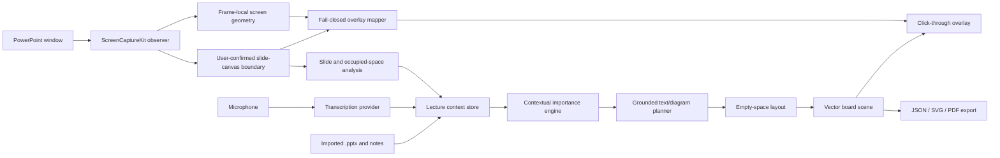

# Architecture

## Decision summary

LectureBoard AI uses a native macOS shell, a pure-Swift core package, a provider boundary around transcription and AI reasoning, and a vector scene graph for board output.

## Runtime separation

### Native application layer

SwiftUI and AppKit provide the setup window, presenter controls, transparent overlay, permissions, menu commands, and lifecycle.

### Capture and observation layer

ScreenCaptureKit discovers and captures only the selected PowerPoint window. Selection freezes the ScreenCaptureKit window identifier, owning process identifier, and exact PowerPoint bundle identifier. Capture start re-enumerates ScreenCaptureKit windows and proceeds only when the identifier is unique and the complete frozen identity still matches; reused identifiers, changed processes, wrong bundles, duplicates, and missing owners fail closed. The native adapter produces immutable exact-window frames and delivery metrics. Frame-status parsing is fail closed: only `.complete` and `.started` create a new delivery, and only `.idle` creates a repeat. Missing, malformed, unknown, `.blank`, and `.suspended` statuses, invalid samples, and conversion failures clear repeatable content, notify an ordered content-unavailable boundary, and require a later `.new` delivery before visual processing resumes. `.stopped` is terminal and uses a fixed localized capture error. Terminal sample, delegate-error, inactive-stream, and start-failure paths emit a structured bounded event through one synchronous first-event router. New capture starts and manual stops reset the telemetry; stale operations and later concurrent terminal callbacks cannot replace the accepted event. Surface scale factor is accepted only in the SDK-documented inclusive range from 1 through 4. Those whole-window deliveries are not admitted to visual stability, content-update, Vision, raster, occupancy, or board-placement processing until the slide canvas has been explicitly confirmed.

Public macOS and PowerPoint APIs do not expose an exact rectangle for the internal rendered slide canvas. ScreenCaptureKit's `contentRect` describes the captured surface, not PowerPoint's internal slide subview, and the public PowerPoint scripting and Accessibility surfaces do not provide a safely bindable exact canvas rectangle. The app therefore freezes a preview from the exact accepted capture operation and asks the user to drag around the visible slide and confirm it. The resulting top-left normalized region must map to at least 32 by 24 source pixels and 1,024 square pixels, and it is bound to that capture operation, exact ScreenCaptureKit window ID, source pixel dimensions, and validated ScreenCaptureKit surface geometry. Capture restart, window mismatch, pixel-dimension mismatch, missing usable surface geometry after the narrow idle policy below, or a change in `contentRect`, scale factor, or content scale invalidates the confirmation and clears visual state. Idle surface handling is a provisional application policy rather than an Apple guarantee. For a verified `.idle` delivery only, if `contentRect`, `scaleFactor`, and `contentScale` are all absent, the app reuses the previously latched surface geometry solely to crop the unchanged visual payload. A complete current tuple is accepted only when it exactly matches the latched geometry. Partial, malformed, conflicting, or non-idle evidence, missing prior geometry, and prior output dimensions that do not match the visual payload all fail closed and poison repeat geometry until a later `.new` frame. The all-absent branch does not inherit or use `screenRect`, so overlay mapping remains closed. The app does not silently infer a replacement from titles, window order, geometry, aspect ratio, or image heuristics. A pre-fix schema-9 live report bounded one failure to `idleRepeatSurfaceGeometryUnavailableOrMismatched`; it did not distinguish absent from mismatched attachments. A later fixed-path schema-9 diagnostic retained confirmed diagnostic canvas state across 18 live idle repeats. The raw idle attachment form and behavior across other PowerPoint modes remain unverified.

Onscreen placement is a separate, dynamic boundary. Every new delivery and every idle delivery outside the all-absent surface branch parses its own ScreenCaptureKit `.screenRect`; an idle delivery may reuse the prior visual payload but never inherits the prior onscreen position. The all-absent surface branch deliberately leaves screen geometry empty even if that sample carries `screenRect`. A missing, malformed, nonfinite, or non-positive current `screenRect` also leaves the frame without screen geometry. This does not by itself change the confirmed canvas crop, whose provenance is the captured surface, but it clears the overlay placement and hides the production overlay until a later accepted frame supplies valid current geometry.

The overlay-coordinate mapper is deterministic and side-effect free. It accepts only a production ScreenCaptureKit canvas confirmation whose capture operation, exact window ID, complete `CaptureSurfaceGeometry`, and output dimensions match the current accepted frame. It checks that `contentRect` scaled by `scaleFactor` remains within the output surface, that `screenRect` scaled by `contentScale` agrees with the captured content within one output pixel of rounding tolerance, and that the outward-rounded canvas crop lies wholly inside the content support rather than surface padding. It then maps the canvas from output pixels into ScreenCaptureKit's global Quartz screen rectangle, requires exactly one validated display to contain the entire target, and converts that target through the paired `CGDisplayBounds` and `NSScreen.frame` snapshot into AppKit's bottom-left window coordinates. Missing, contradictory, cross-display, or multiply contained geometry returns no placement; there is no main-display, window-descriptor, title, ordering, or last-known-position fallback.

App integration adds a second freshness check: a placement is usable only when its capture operation, window ID, and frame sequence equal the active capture and latest eligible frame. Production rendering requires confirmed semantic identity and fresh completed visual grounding. It also requires the frozen PowerPoint PID and exact bundle to be frontmost, exactly one matching on-screen layer-zero Core Graphics window, agreement between that window's bounds and the current `screenRect` within a two-point edge tolerance, no earlier on-screen window intersecting the target, and exactly one current `NSScreen` containing the AppKit target. Any failed mapping, lifecycle or semantic boundary, missing current position, capture-content or visual uncertainty, manual suppression, focus or Space change, stale placement, or independently expiring eligibility lease hides the overlay. Only an eligible current capture delivery renews the lease; unchanged physical renders are deduplicated without bypassing eligibility. Moving screen geometry can produce a new placement without invalidating an otherwise unchanged confirmed surface crop. Capture start clears and hides a loaded full-screen demo panel so that demonstration output cannot leak into production capture rendering. The safe default identity provider cannot show production output. The pure mapper and these app boundaries have deterministic synthetic native coverage. A narrow schema-8 direct static exact-window diagnostic reached metadata-only overlay state `mapped`, but it used `diagnosticFullFrame` and identity remained unavailable, so no production panel was rendered. User-confirmed canvas accuracy, visible PowerPoint alignment, real window-list z-order, multi-display arrangements, window resizing, and click-through behavior have not yet been runtime-verified.

After confirmation, the app outward-rounds the normalized rectangle to bounded source pixels and crops each matching exact-window delivery. The coarse stability fingerprint, fixed 160-by-90 RGB content fingerprint, Vision input, maximum-640-pixel raster, occupied regions, and board-placement input all derive from this cropped canvas. `LectureBoardCore` confirms coarse stability only after consecutive matching fingerprints. A confirmed large image difference is named `.significantVisualChange`; it is not a statement that the PowerPoint slide identity changed. A coarse or dense visual-change candidate immediately invalidates prior analysis. A missing or invalid dense fingerprint does the same; a confirmed coarse frame without a valid dense fingerprint cannot start analysis. After the detector returns to baseline, proposals remain closed until analysis of the current frame completes. The dense detector defaults remain a difference threshold of `0.08`, minimum changed-pixel fraction of `0.001`, persistence tolerance of `0`, and three identical qualifying observations. The live erase candidate did not receive the third qualifying observation, so the thresholds were not weakened.

For one currently pending dense candidate, the app may request at most two actual `SCScreenshotManager` samples approximately 100 milliseconds apart. Core issues an opaque candidate token, and a one-shot fingerprint can add evidence only to that exact token. App acceptance also requires the same capture operation, complete exact PowerPoint identity, stream anchor, confirmed canvas and generation, semantic-identity state and generation, and visual-content continuity. The capture actor re-enumerates the exact window before and after the OS request, permits only one OS screenshot at a time, accepts only valid BGRA complete/started output with a complete surface tuple, and keeps provider-busy deferral bounded to ten waits. A one-shot result has no synthetic stream sequence, delivery kind, `displayTime`, or screen-position provenance. It therefore does not update continuous-capture metrics, semantic identity, the post-identity frame gate, overlay mapping, or the overlay lease. Fresh-only analysis also cannot render or renew the overlay; a later eligible continuous frame remains necessary. Stale, malformed, mismatched, replaced, reset, or exhausted episodes fail closed without weakening the detector thresholds or invalidating an otherwise valid canvas. Deterministic Core and native tests cover these boundaries. Live PowerPoint status and geometry attachments, timing, and post-erase behavior remain unverified.

The app counts both coarse stable visual changes and persistent dense-RGB changes as content revisions rather than slide changes. Until confirmation, capture counts remain observable but stable-frame count, content-revision count, Vision analysis, raster analysis, and board placement remain closed.

The independent identity foundation is deterministic and provider-neutral. Core confirms an initial baseline or a slide change only after two consecutive samples with the same presentation-session token and slide ID. An unavailable gap discards continuity; recovery establishes a baseline instead of inferring a transition across the gap. A presentation-session change likewise establishes a new baseline. An index update for the same slide ID updates the board number without counting a change or clearing its elements. The app accepts provider observations only when their selected-window target, capture session, and sequence remain current. Frames received while an identity candidate is being confirmed still contribute to delivery metrics but are excluded from visual analysis. At baseline establishment or a confirmed transition, old analysis and board scenes are discarded; analysis resumes only for a `.new` frame whose ScreenCaptureKit `displayTime` is strictly later than the app's local mach-absolute acceptance time for the confirming observation. Apple Speech results carry a local mach-absolute callback time. Independent App-side and Apple-provider generations reject stale callbacks. A semantic slide, canvas, or capture boundary stops transcription, invalidates prior segments and callbacks, and leaves transcription closed until the user explicitly resumes it. A final result also cannot create a board proposal if it was emitted before the identity boundary, before the app locally accepted the post-boundary frame, or while that frame is still required; delayed MainActor delivery does not relax either timestamp boundary. The post-boundary gate exposes `waiting`, `synchronized`, and `timedOut` states. Timeout remains fail-closed and cannot admit an idle, missing-time, equal-time, older, or otherwise stale frame. Boundary tokens prevent delayed timeout callbacks from changing a newer boundary or stopped session, and a later strictly newer `.new` frame can recover after timeout. These transcription boundaries are covered by controllable providers, not live microphone input. The frame gate makes a static-slide pause diagnosable, but it does not implement or runtime-verify automatic fresh-frame acquisition.

The default identity provider is deliberately side-effect free: for each accepted capture start, it requests no Automation permission, sends no Apple Event, and emits one unavailable observation. A read-only PowerPoint probe observed Automation preflight status `0`, one slide-show window, and two Core Graphics windows, but PowerPoint's inherited `window.id` was `nil`. The semantic slide result therefore could not be bound to the exact ScreenCaptureKit/Core Graphics window ID. A production provider remains unimplemented, and no weaker name-, order-, or geometry-based fallback is accepted.

For each accepted stable visual frame or content update from the confirmed canvas, the native analyzer creates an sRGB RGB8 raster whose long edge is at most 640 pixels. It runs Vision text recognition and rectangle detection and separately runs deterministic raster occupancy analysis. The raster output is deliberately named `strokeCandidateRegions`; candidates may include text, diagram edges, or other visible material inside the confirmed region and are not confirmed PowerPoint ink. Vision's lower-left coordinates are converted to the app's top-left normalized canvas coordinate system before deterministic Core logic filters low-confidence, tiny, and near-full-frame detections, pads text, rectangles, and stroke candidates, and transitively merges touching occupied regions. The app observes PowerPoint rather than modifying the source presentation in the first implementation.

Semantic slide changes, canvas selection or invalidation, and capture lifecycle boundaries advance a current-board-context generation and discard earlier transcript and board candidates. A transcript segment collected before such a boundary cannot be proposed again in the new context. Transcript-driven board proposals additionally require a ready visual analysis with at least one occupied region; an empty result keeps placement fail-closed rather than treating an unverified blank map as safe space. Capture end clears the latest stable frame, visual analysis, and board scene. These are deterministic safety boundaries, not evidence of live PowerPoint correctness.

`BoardSceneComposer` admits only confirmed and pinned intents. Proposed, deferred, and dismissed intents stay in candidate context. If composition produces no public-scene change, `AppModel` does not advance `boardSceneAnalysisGeneration` or invoke overlay eligibility or rendering. Deterministic tests cover this boundary; live board rendering remains unverified.

The bundled demo scene is isolated from live capture state. Capture start clears it, and demo generation is disabled while capture is active or capture-provider shutdown is in progress. This prevents demonstration content from being mistaken for capture-grounded board output; it does not validate live rendering.

The metadata-only runtime report uses schema version 10. Schema 6 added `slideCanvasState`, schema 7 added overlay-mapping state and fail-closed rejection reasons, schema 8 added confirmation provenance, and schema 9 added bounded canvas-failure metadata. Schema 10 adds nine `captureFailureSource` categories and 21 public `captureSCStreamErrorCode` categories. The code field is required only for the two known-ScreenCaptureKit-error source categories and forbidden for the other seven. Completed and non-capture-failure reports normalize both fields to `nil`; schema-1 through schema-9 reports remain decodable and ignore them. A current capture failure with missing, malformed, unknown, or inconsistent bounded evidence normalizes fail closed to `unclassifiedCaptureFailure`. The accepted first terminal event is copied into the runner's final JSON before model shutdown clears live state. The report continues to exclude the selected rectangle, slide IDs, presentation paths or tokens, captured images, recognized text, window titles, coordinates, display identifiers, raw error domains, numeric codes, descriptions, and `userInfo`. Historical schema-1 and pre-semantic-correction schema-2 `slideChangeCount` values still represent the older image-difference heuristic rather than verified slide identity. Schema-10 normalization, ordering, reset, stale-operation, and runner-retention paths have deterministic coverage; live schema-10 failure classification remains unverified.

The fixed schema-8 app has completed one five-second direct-executable static diagnostic against exact PowerPoint window ID 13577 without requesting Screen Recording permission. It recorded 53 new frames, one stable frame, completed Vision analysis, `diagnosticFullFrame`, confirmed canvas state, metadata-only overlay state `mapped`, unavailable identity, zero content revisions, and zero slide changes. This remains build-specific schema-8 evidence only for the direct static exact-window capture and metadata path. Because the whole captured window was confirmed automatically for diagnostic purposes, it does not validate a user-confirmed canvas, visible overlay alignment, or production rendering.

A strict PowerPoint helper later passed exact unique Window-menu selection, exact-window focus, and slideshow safety probes without a weaker name-, enumeration-order-, or approximate-geometry fallback. A schema-8 dynamic attempt then received one new frame and two repeats before the diagnostic canvas was invalidated; it stopped after about 535 milliseconds, before the first scheduled slide or mouse input. A pre-fix schema-9 rerun bounded that failure to `idleRepeatSurfaceGeometryUnavailableOrMismatched`, still before input. A separate post-fix schema-9 app was frozen and strictly signature-verified.

Its later fixed-path dynamic report `LectureBoard-Runtime-Schema9-IdlePolicy-Dynamic-2026-08-31.json`, SHA-256 `390bee97a34dbde9dc434f876cdf2b05c0a4836effd0d36b528e6231db3ca7e2`, recorded approximately 40.5 seconds, 154 snapshots, and 33 delivered frames: 15 new frames plus 18 idle repeats. The first snapshot already contained 1 new frame and 2 idle repeats while retaining confirmed diagnostic canvas state; all 154 snapshots remained confirmed. The run reached 4 stable frames and four controlled inputs correlated with four content revisions. Maximum analysis counts were 11 recognized-text observations, 13 rectangles, 37 stroke candidates, and 11 occupied regions. Semantic identity remained unavailable and slide changes stayed at zero. Overlay mapping succeeded zero times: 7 snapshots reported `screenGeometryUnavailable` and 147 reported `canvasOutsideCapturedContent`. This is narrow idle-survival and visual-content-update evidence, not verified semantic slide transitions, OCR or coordinate correctness, a user-confirmed canvas, visible alignment, or production rendering.

A later fixed-path schema-9 five-stroke report, `LectureBoard-Runtime-Schema9-MouseInk-2026-09-01.json`, SHA-256 `534a285e8f3830891c374746338aa361ab9ebf15cf1f4b199e686d1166b17cb7`, recorded 78 snapshots and 80 frames over 20 seconds: 65 new, 15 repeat, four content revisions, and zero slide changes. The before and after-erase images were byte-identical, and the after-ink image contained five connected components. Single-stroke and five-stroke reruns also restored the image but produced no separate post-erase revision. This validates visible synthetic mouse strokes and visual erase restoration only, not semantic or per-input classification, existing-ink detection, production canvas behavior, or current schema-10 runtime behavior. A no-content-mutation static control still recorded one content revision and therefore does not establish a false-positive-free detector. An earlier aggregate capture failure remains source-unknown because schema 9 did not retain terminal provenance.

The latest reviewed ignored helper source has SHA-256 `37e07382857c0a72cdfc08e8bb30b52162837409b004ced6d6f34e8bef2f7aaf`; its separately saved reviewed arm64 binary `DriveExactPowerPointInk-Schema10-Reviewed-2026-09-01` has SHA-256 `e7d5b1d01fa6929834526766fc606c1deb2fc78f4558cd0a990e65a62dd9a15d`. Its GUI-free self-test passed 20 of 20 cases, and lint, Swift 6 strict type checking, compilation, and independent review passed. This validates the tested helper policy only. Live all-Spaces switching, post-Escape WindowServer behavior, Accessibility focus mutation, and end-to-end input remain unverified. A separate LaunchServices check verified startup, argument forwarding, no Screen Recording permission request, a `screenRecordingUnavailable` fail-closed report, and automatic exit. It did not verify capture authorization or capture through LaunchServices.

### LectureBoardCore

The independent Swift package owns serializable models, validated normalized slide-canvas regions and outward pixel mapping, stable-frame and significant-visual-change classification, persistent RGB-content-change detection, deterministic slide-identity tracking, RGB raster models, stroke-candidate analysis, slide-observation filtering, normalized occupied-region assembly, runtime-report models, importance scoring, grounded intent classification, empty-space layout, and scene composition. It does not import AppKit, ScreenCaptureKit, Vision, Speech, or any cloud SDK.

### Provider layer

Transcription and slide identity conform to narrow native-app protocols. The initial repository includes an Apple Speech single-language prototype and a no-side-effect unavailable slide-identity provider. The latter is a safe boundary default, not a production PowerPoint adapter. A semantic-planning provider boundary is still future work. Future transcription and planning providers may use SpeechAnalyzer, whisper.cpp, a local language model, or an explicitly configured cloud API.

## Intended core data flow

The following is the target end-to-end lecture flow, not a statement that every stage is implemented or runtime-verified. The current Core contains heuristic importance scoring, grounded intent classification, empty-space layout, vector scene composition, and evidence-bearing models. A dedicated factual validator, complete live context-store wiring, and stable live renderer animation remain unimplemented or unverified.

1. Final transcript segments enter the context store.
2. The importance scorer compares each segment with slide text and recent speech.
3. The classifier selects a board form without inventing new content.
4. A validator attaches source evidence and rejects unsupported names, numbers, dates, quotations, and formulas.
5. The layout engine chooses a free normalized region.
6. The scene composer emits vector elements.
7. The renderer animates only newly confirmed elements and leaves existing elements still.

## Scene graph

Board output is stored as text blocks, rounded rectangles, ellipses, lines, arrows, normalized positions, style roles, source intent identifiers, and language tags. This allows resolution-independent display and later SVG/PDF export.

## Failure-containment design

These are design constraints and prototype boundaries rather than a claim of complete runtime validation:

- The overlay prototype is a separate window configured to be click-through; its production frame is computed from the current exact-window delivery and confirmed canvas. Mapping and stale-placement rejection are implemented and deterministically tested, but actual PowerPoint position and sizing, multiple-display behavior, resize handling, z-order, click-through behavior, and pen-tablet non-interference remain runtime-unverified.
- PowerPoint remains the authoritative lecture application.
- The speech prototype does not modify or control PowerPoint; end-to-end runtime behavior during transcription failure is unverified.
- The deterministic classifier supports proposed and deferred states, and public-scene gating is implemented and tested so that only confirmed or pinned intents render. Live PowerPoint board output remains unverified.
- Session persistence is not implemented. When added, it is intended to be optional and transactional.

## Initial implementation compromises

- The first speech path handles one selected language at a time.
- The initial context engine is deterministic and heuristic, serving as a testable baseline.
- The production overlay now uses a fail-closed mapping from the exact current frame's screen geometry to the confirmed slide canvas. The separate demo path still intentionally uses a selected full display. Live coordinate correctness and z-order remain unverified.
- The current schema-10 source passes 142 Core tests in 15 suites, 251 native app tests in 30 suites, and the complete 14-stage `make verify` gate. A frozen schema-9 app separately completed build-specific idle and visible mouse-stroke diagnostics; those results do not verify live schema-10 classification, live one-shot sampling, semantic slide transitions, per-input ink classification, existing-ink detection, microphone input, user-confirmed canvas localization, visible overlay alignment, or production rendering. Historical schema-1, pre-semantic schema-2, fixed-app schema-8, and schema-9 results remain build-specific evidence only.
- Image content is not an independent slide-identity signal. The tracker and app safety boundaries are implemented, but the production PowerPoint provider and live transition validation are not. The default provider therefore cannot establish actual slide identity.
- Explicit fail-closed timeout/state handling after an identity boundary is implemented and deterministically tested. Automatic exact-window fresh-frame acquisition and live timeout behavior with a production identity provider remain unimplemented or unverified.
- The visual pipeline is fail-closed until the user confirms a slide-canvas rectangle and then uses only that crop. Selection, pixel mapping, cropping, invalidation, and pipeline gating have deterministic Core and native fixture coverage. Live PowerPoint localization and UI-exclusion accuracy, ScreenCaptureKit surface padding and `contentRect` mapping, presentation modes, resizing, and display arrangements remain unverified.
- Vision and raster candidate paths compile and are covered by deterministic tests on cropped synthetic images, but live OCR accuracy, coordinate fidelity, false detections, candidate thresholds, and representative-deck behavior remain unverified.
- `strokeCandidateRegions` are occupancy candidates, not verified existing PowerPoint ink. Existing-ink classification, thin or semitransparent stroke calibration, and pen-tablet behavior remain unverified.
- LaunchServices capture authorization, window reselection, and lecture-length reliability remain unverified; only limited startup, argument forwarding, no-request, fail-closed reporting, and automatic exit have been checked through LaunchServices.
