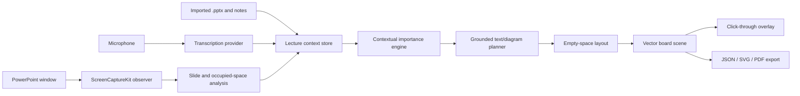

# Architecture

## Decision summary

LectureBoard AI uses a native macOS shell, a pure-Swift core package, a provider boundary around transcription and AI reasoning, and a vector scene graph for board output.

## Runtime separation

### Native application layer

SwiftUI and AppKit provide the setup window, presenter controls, transparent overlay, permissions, menu commands, and lifecycle.

### Capture and observation layer

ScreenCaptureKit discovers and captures only the selected PowerPoint window. The native adapter produces downsampled luminance fingerprints and immutable preview frames. `LectureBoardCore` confirms a stable candidate only after consecutive matching fingerprints and reports a slide change only after the new candidate is stable. A native Vision adapter runs accurate text recognition and rectangle detection only on newly confirmed stable frames. Vision's lower-left coordinates are converted to the app's top-left normalized coordinate system before deterministic Core logic filters low-confidence，tiny，and near-full-frame detections，pads occupied areas，and transitively merges touching regions. The app observes PowerPoint rather than modifying the source presentation in the first implementation.

### LectureBoardCore

The independent Swift package owns serializable models，stable-frame classification，slide-observation filtering，normalized occupied-region assembly，importance scoring，grounded intent classification，empty-space layout，and scene composition. It does not import AppKit，ScreenCaptureKit，Vision，Speech，or any cloud SDK.

### Provider layer

Transcription and semantic-planning providers conform to narrow protocols. The initial repository includes an Apple Speech single-language prototype. Future providers may use SpeechAnalyzer, whisper.cpp, a local language model, or an explicitly configured cloud API.

## Core data flow

1. Final transcript segments enter the context store.
2. The importance scorer compares each segment with slide text and recent speech.
3. The classifier selects a board form without inventing new content.
4. A validator attaches source evidence and rejects unsupported names, numbers, dates, quotations, and formulas.
5. The layout engine chooses a free normalized region.
6. The scene composer emits vector elements.
7. The renderer animates only newly confirmed elements and leaves existing elements still.

## Scene graph

Board output is stored as text blocks, rounded rectangles, ellipses, lines, arrows, normalized positions, style roles, source intent identifiers, and language tags. This allows resolution-independent display and later SVG/PDF export.

## Failure containment

- The overlay is a separate, click-through window and can be hidden immediately.
- PowerPoint remains the authoritative lecture application.
- Transcription failure does not block slide presentation.
- Uncertain semantic output is deferred rather than displayed.
- Session persistence is optional and transactional.

## Initial implementation compromises

- The first speech path handles one selected language at a time.
- The initial context engine is deterministic and heuristic, serving as a testable baseline.
- The first overlay uses the selected display rather than exact PowerPoint-window coordinate mapping.
- The continuous selected-window capture path compiles，but its permission flow，frame delivery，and thresholds have not yet been validated with a real PowerPoint presentation.
- The Vision text/rectangle adapter and occupied-region preview compile，but recognition accuracy，coordinate fidelity，false detections，and thresholds have not yet been validated with real slide images.
