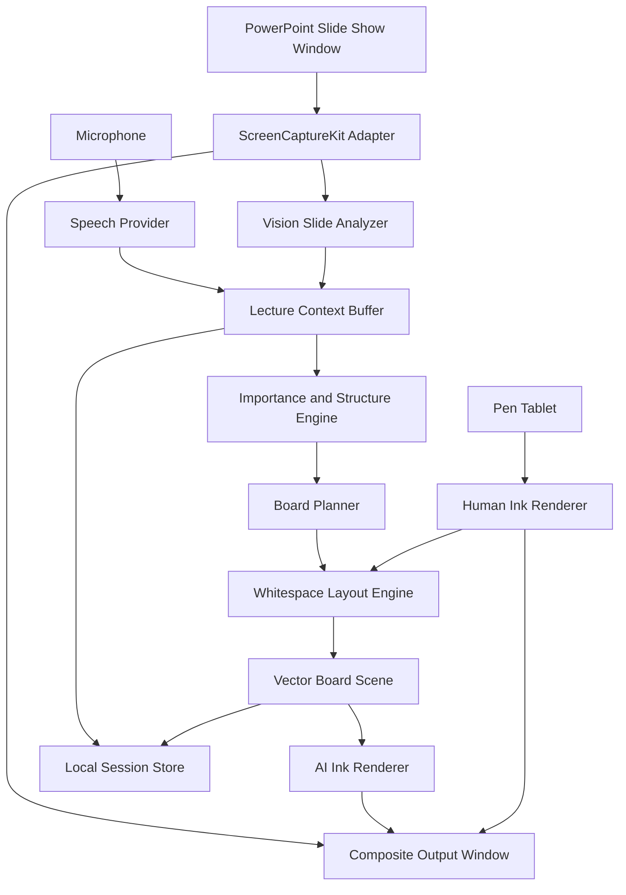

# LectureBoard AI macOS版 技術設計書 ver.1.3

更新日：2026年8月29日

## 1．文書の目的

本書は，LectureBoard AIのmacOS版を実装するための技術設計を定める．対象は，Microsoft PowerPoint for Macを用いた対面講義，オンライン講義，ハイブリッド講義である．

本アプリは，講師の発話を逐語的に字幕化することを目的としない．講師が通常どおり話している間に，現在のスライドと講義文脈を理解し，スライド上の安全な空白へ，教育上有用な文字・矢印・囲み・関係図を自動的に描くことを目的とする．

## 2．確定した製品範囲

### 2.1 対象OS

当面はmacOSだけを正式対象とする．

- 最低対象：macOS 26
- 主検証環境：Apple silicon搭載Mac，macOS 26
- 初期開発言語：Swift 6
- UI：SwiftUIを中心とし，画面取得，透明ウィンドウ，ペンタブ入力にはAppKitを併用する

WindowsおよびLinuxは当面実装しない．ただし，板書判断とデータ形式はmacOSフレームワークから分離し，将来移植を妨げない構造とする．

### 2.2 対象プレゼンテーション

第1対象は，PowerPoint for Macのスライドショーウィンドウである．初版はPowerPointファイルを直接編集しない．

将来候補として，Keynote，PDF，ブラウザスライドを残すが，MVPの受入条件には含めない．

### 2.3 対象言語

初期の品質保証対象は次の三つとする．

- 日本語
- 英語
- 日本語と英語が混在する講義

アプリUIと板書出力言語は独立して管理する．言語識別はBCP 47タグを使用する．

## 3．基本原則

### 3.1 ゼロコマンド標準

「板書してください」「図にしてください」等の音声命令を要求しない．音声コマンドの一覧を覚えることも，ヘルプを見ることも，呼出語を発することも標準動作には含めない．

AIは，次の情報を統合して板書の必要性を判断する．

- 現在のスライド画像
- スライド上の認識文字
- スライド上の図表・占有領域
- 直前までの確定発話
- 講義中に繰り返された概念
- 定義，対比，因果関係，列挙，結論，問い
- 発話の間，速度，音量変化等の補助的特徴
- 既に表示したAI板書
- 講師のペンタブ入力
- 現在の板面に残る空白

講師が明示的に操作する機能は，AI一時停止，取消し，固定，消去，講義終了等の安全操作に限定する．

### 3.2 学生側の表示安定性

認識途中の文字，推論途中の候補，低信頼度の固有名詞や数値は，学生側へ直ちに表示しない．

- 意味単位が確定してから描画する
- 一度表示した板書は原則として動かさない
- 訂正が必要な場合は，直近の要素だけを穏やかに差し替える
- 同じ内容を重複して書かない
- 板書頻度を制限し，学生が読む時間を確保する

### 3.3 人間優先

講師のペンタブ入力はAI板書より常に優先する．講師が書き始めた領域は，直ちに人間占有領域として扱う．AIはその領域へ新しい要素を置かない．

AI板書と講師手書きは別レイヤーとして保存する．

## 4．システム構成



## 5．モジュール

### 5.1 LectureBoardCore

macOS固有フレームワークに依存しない中核ライブラリである．

責務：

- 講義セッションモデル
- 発話セグメントモデル
- スライド文脈モデル
- 板書要素モデル
- 言語ポリシー
- 重要度評価
- 文字／図形の選択
- 重複抑制
- 空白配置
- 履歴，取消し，固定
- JSON保存

このリポジトリの初期実装では，規則ベースの`ContextAwareBoardPlanner`を備える．これは完成版AIの代替ではなく，入出力契約，評価指標，UI，テストを先に確立するための参照実装である．

### 5.2 LectureBoardApp

macOSアプリ本体である．

責務：

- 講義開始画面
- PowerPointウィンドウ選択
- 画面収録権限案内
- マイク権限案内
- 講義中の最小操作バー
- AI板書と講師手書きの描画
- 合成出力ウィンドウ
- 設定
- 講義後の確認と書出し

### 5.3 CaptureAdapter

ScreenCaptureKitを使用し，ユーザーが明示的に選択したPowerPointスライドショーウィンドウだけを取得する．

初版では，デスクトップ全体を常時取得しない．通知や別ウィンドウの意図しない共有を避けるためである．

入力：

- `SCWindow`
- フレーム時刻
- ウィンドウ座標と大きさ

出力：

- `CGImage`または`CVPixelBuffer`
- ウィンドウ状態
- フレーム欠落・終了イベント

### 5.4 SlideAnalyzer

Visionと画像解析を組み合わせて，現在スライドの占有領域を生成する．

初期処理：

1. スライドショー映像を低解像度へ縮小する．
2. `VNRecognizeTextRequest`で文字領域を検出する．
3. エッジ密度，局所分散，背景との差を用いて図・写真・線の占有候補を作る．
4. 検出領域へ安全余白を加える．
5. グリッドへ投影し，空白マップを作る．
6. 講師の手書き領域と既存AI板書領域を加える．

スライドの背景が白とは限らないため，単純な白画素判定には依存しない．局所背景の一様性と既存オブジェクト境界を用いる．

### 5.5 SpeechProvider

音声認識を差し替え可能なプロトコルにする．

```swift
protocol SpeechProvider {
    func start(configuration: SpeechConfiguration) async throws
    var events: AsyncStream<SpeechEvent> { get }
    func stop() async
}
```

候補：

- macOS標準のSpeechフレームワーク
- macOS 26以降のSpeechAnalyzer／SpeechTranscriber
- ローカルモデル
- 明示的に許可されたクラウド音声認識

初版の標準はローカル優先とする．ただし，日本語・英語混在認識の品質は，実際の講義音声を使って比較評価する．

### 5.6 LectureContextBuffer

直近の発話だけでなく，講義の流れを保持する．

保持対象：

- 直近60〜180秒の確定発話
- 現在スライドで繰り返された概念
- 前スライドから持ち越された定義
- 既存板書
- 未確定候補
- 用語集
- 言語切替履歴

長時間講義では，逐語全文を毎回モデルへ渡さず，階層的要約を作る．

```text
音声フレーム
  ↓
確定発話セグメント
  ↓
現在の説明単位
  ↓
現在スライド要約
  ↓
講義章要約
```

### 5.7 Importance and Structure Engine

何を板書するかを決める中核である．詳細は`context-aware-board-planning-ja.md`に定める．

重要度の主な特徴：

- スライドにない新規補足
- 概念の定義
- 因果関係
- 比較・対立
- 列挙のまとめ
- 中心的な問い
- 反復または言い換え
- 発話の強調
- 後続説明の前提
- 学生が記憶すべき短い関係

抑制要因：

- フィラー
- 単なるスライド読み上げ
- 雑談
- 既存板書との重複
- 認識確信度不足
- 根拠が薄い推測
- 空白不足
- 直前に板書したばかりであること

### 5.8 BoardPlanner

意味構造を，学生に見せる板書オブジェクトへ変換する．

```json
{
  "kind": "causalChain",
  "language": "ja-JP",
  "items": [
    "大量生産",
    "資源消費の増加",
    "環境負荷の増大"
  ],
  "importance": 0.86,
  "confidence": 0.93,
  "sourceSegmentIds": ["..."],
  "renderPolicy": {
    "stable": true,
    "allowAutomaticReplacement": false
  }
}
```

学生に表示する文章は，原則として発話とスライドに根拠を持つ．生成モデルを使う場合も，出典セグメントを保持し，意味の追加を禁止する検証器を通す．

### 5.9 WhitespaceLayoutEngine

入力：

- スライド占有領域
- 既存AI板書
- 講師手書き
- 板書要素の推奨寸法
- 読み順

出力：

- 正規化座標
- 表示可否
- 外部板書面への退避提案

MVPでは二次元グリッド上の最大空矩形を利用する．将来は，文字行の流れ，図の視線誘導，スライドのデザイン中心，講師の利き手等を加味する．

### 5.10 Vector Board Scene

板書は，最初から一枚の画像として生成しない．編集可能なシーングラフとして保持する．

- text
- path
- arrow
- box
- ellipse
- group
- causal-chain
- comparison
- concept-map

これにより，取消し，固定，再配置，言語差替え，PDF／SVG出力，講師加筆とのレイヤー分離が可能になる．

## 6．文字と図形の選択

### 6.1 文字が適する場合

- 一文の定義
- 短い補足
- 三点以下の列挙
- 重要な問い
- 例外や注意

### 6.2 図形が適する場合

- 原因と結果が二段階以上続く
- 二つの考え方を比較する
- 上位概念と下位概念がある
- 複数概念が相互作用する
- 時系列・手順を示す
- 文字だけでは関係を見失いやすい

### 6.3 図形テンプレート

初版：

- 矢印
- 囲み
- 丸囲み
- 下線
- 因果連鎖
- 二項比較
- 階層図
-簡単な概念マップ

初版対象外：

- 精密な地図
- 生物・機械等の写実図
- 複雑な化学構造式
- 手描きの自由イラストを完全自動生成すること

## 7．描画スタイル

### 7.1 整ったデジタルインク風

標準．文字の可読性，オンライン配信，PDF出力を優先する．

### 7.2 より手書き風

線幅，わずかな傾き，線の揺れ，矢印形状，描画速度を変え，板書らしさを高める．ただし，可読性を下げるほどの揺れは許可しない．

### 7.3 詳細設定

- 文字サイズ
- 線幅
- 手書き感
- 図形の整い具合
- インク色
- 強調色
- 描画速度
- 板書密度
- 文字／図形比率
- 二言語併記方式

## 8．表示方式

### 8.1 透明オーバーレイ

対面講義向け．PowerPointウィンドウの上へ透明パネルを置く．通常はクリック透過とし，ペンモード時だけ入力を受ける．

### 8.2 合成出力ウィンドウ

オンライン講義の標準．

```text
PowerPoint取得映像
＋AI板書
＋講師手書き
＝LectureBoard Output
```

Zoom，Teams，Google Meetでは，この一つのウィンドウを共有する．PowerPointと透明オーバーレイを別々に共有する問題を避ける．

## 9．ペンタブ入力

AppKitのタブレットイベントを受け取り，次を保存する．

- 正規化座標
- 時刻
- 筆圧
- 傾き
- デバイス識別子
- ペン／消しゴム等の道具種別

機器が筆圧や傾きを提供しない場合も，位置と時刻だけで描画できる．

講師がAI板書を囲む，矢印を付ける，取り消し線を引く行為は，AI板書を直接破壊せず，講師レイヤーへ追加する．

## 10．言語設計

### 10.1 独立した設定

- UI言語
- 音声認識候補言語
- スライド言語
- 板書出力言語
- 講義後資料の言語

### 10.2 日英混在

- 短い意味単位ごとに言語を判定する
- スライド表記を優先する
- 一度確定した専門用語の表記を維持する
- 必要な重要語だけ日英併記する
- 全文二言語表示は，空白と可読性が十分な場合だけ許可する

## 11．データ保存

### 11.1 セッションフォルダ

```text
LectureBoard Sessions/
  2026-08-29_Sustainability/
    session.json
    board.json
    transcript.json        # 保存を許可した場合だけ
    slide-thumbnails/      # 保存を許可した場合だけ
    exports/
```

### 11.2 既定値

- 音声保存：OFF
- 画面録画保存：OFF
- 文字起こし保存：OFF
- AI板書保存：ON
- 講師手書き保存：ON
- クラウド送信：OFF

## 12．プライバシーとセキュリティ

- 権限は必要時に説明して要求する
- ScreenCaptureKitでユーザーが選んだ対象だけを取得する
- APIキーをKeychainへ保存する
- ログへ講義本文を出さない
- クラウド利用時は送信対象を画面上に明示する
- クラウド障害時はローカルの安全な縮退動作へ移る
- 自動更新を導入する場合は署名検証を必須とする
- 一般配布する`.app`はDeveloper ID署名とApple notarizationを行う

詳細は`privacy-security-ja.md`を参照する．

## 13．性能目標

以下は設計目標であり，実測後に調整する．

- 画面取得：30 fpsを標準，解析は必要に応じて1〜5 fpsへ間引く
- ペン表示遅延：体感上即時，目標50 ms未満
- 確定発話から板書候補：通常2秒以内
- 板書追加間隔：標準8秒以上
- 1枚のスライドに同時表示するAI板書：標準3〜6要素
- CPU／GPU負荷：PowerPointとオンライン会議を阻害しない範囲
- ネット切断：講義と手書きは継続可能

## 14．失敗時の動作

### 音声認識が不安定

板書を増やさず，内部候補を保留する．講師へ頻繁な確認を出さない．

### 安全な空白がない

既存内容へ重ねない．候補を保留するか，別板書面へ送る．

### PowerPoint取得が止まる

最後のフレームを固定し，明確な状態表示を講師画面だけに出す．自動再接続を試す．

### AIプロバイダが停止する

規則ベースの最小板書，またはAI板書停止へ縮退する．講師のペン入力は継続する．

### 誤板書

直前取消しを一操作で行えるようにする．取消し履歴は品質改善用に保存できるが，標準では外部送信しない．

## 15．テスト戦略

### 15.1 単体テスト

- 日本語・英語の定義検出
- 因果・比較・列挙検出
- フィラー抑制
- スライド読み上げ抑制
- 重複抑制
- 空白配置
- 人間占有領域回避
- JSON互換性

### 15.2 統合テスト

- PowerPointスライドショー取得
- 画面収録権限の初回・拒否・再許可
- マイク権限
- 日本語，英語，日英混在音声
- Wacom等の外付けペンタブ
- Zoom，Teams，Google Meet共有
- 外部ディスプレイ
- フルスクリーンとウィンドウ表示

### 15.3 教育評価

- 講師が本来書きたかった内容との一致
- 板書しすぎ・しなさすぎ
- 学生の可読性
- ノート取得の妨げにならない安定性
- 誤板書の重大度
- 文字と図形の選択妥当性

## 16．GitHub公開方針

想定公開先：`akiyama709/lectureboard-ai`

- `main`は常にテスト通過状態を維持する
- 機能開発はPull Requestを使用する
- Issueテンプレートを用いる
- 実講義データはリポジトリへ置かない
- 研究評価データは同意・匿名化・権利確認を経て別管理する
- 公開前に所属機関の知財・研究倫理・情報管理規程を確認する
- 初期ライセンス案はMIT Licenseとする

## 17．実装順序

### Milestone 0：基盤

- 中核モデル
- 規則ベース板書判断
- 空白配置
- SwiftUIデモ
- 自動テスト
- GitHub文書とCI

### Milestone 1：実音声

- マイク選択
- 日本語・英語音声認識
- 意味単位分割
- 文脈バッファ
- 確定発話だけを板書判断へ送る

### Milestone 2：PowerPoint

- PowerPointウィンドウ選択
- ScreenCaptureKit連続取得
- スライド変化検出
- Visionによる占有領域
- 合成出力ウィンドウ

### Milestone 3：ペンタブ

- 低遅延手書き
- 筆圧・傾き
- 人間占有領域
- AI板書とのレイヤー分離

### Milestone 4：高度な文脈AI

- プロバイダプロトコル
- 根拠付き構造化出力
- 幻覚抑制
- 日英混在用語集
- ローカル／クラウド選択

### Milestone 5：β版

- 講義後編集
- PDF／SVG／Markdown出力
- クラッシュ回復
- 署名・notarization
- 実講義評価

## 18．公式技術資料

- ScreenCaptureKit: https://developer.apple.com/documentation/screencapturekit
- macOS screen-capture sample: https://developer.apple.com/documentation/screencapturekit/capturing-screen-content-in-macos
- Vision text recognition: https://developer.apple.com/documentation/vision/recognizing-text-in-images
- SpeechAnalyzer: https://developer.apple.com/documentation/speech/speechanalyzer
- Speech live audio: https://developer.apple.com/documentation/speech/recognizing-speech-in-live-audio
- PencilKit: https://developer.apple.com/documentation/pencilkit
- PowerPoint add-ins: https://learn.microsoft.com/en-us/office/dev/add-ins/powerpoint/powerpoint-add-ins
